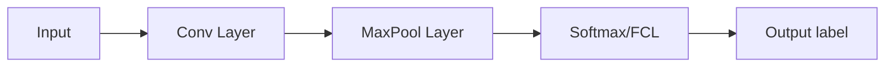

# CNN from scratch

### Introduction:
In this project, I have shared the implementation of CNN from Scratch. Credit goes to Dr. Ahlad Kumar ([His YouTube Channel link](https://www.youtube.com/c/AhladKumar/about))

The colab contains implementation of forward and back propogation of:
 - Convolution Layer
 - Max Pool Layer
 - Softmax/FCL

### Network Architecture:

The network has 3 layers - Conv, MaxPool and Softmax

### Results:

The network is tested on MNIST digits dataset and accuracy of 66% is acheived for training set and 62% for test set. Accuracy can be further improved by better weight init. strategies. For now, the weights were initialized randomly. 

The notebook can be accessed throug this [link](https://colab.research.google.com/drive/13VWa6iEXCuSY83xmvN4QGQyZDBUuiDpb?usp=sharing).

